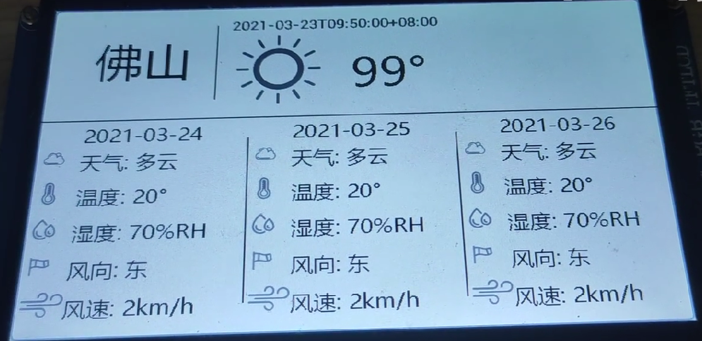

# 硬件

正点原子 阿波罗STM32F429开发板

STM32以太网MAC+外部PHY(LAN8720)

7寸 RGB LCD

# 软件

*  实时操作系统 -u C/OS-II 
*  网络协议栈 - LwIP 
  * 使用BSD Socket API 进行网络编程
* GUI界面 - lvgl 
* 使用心知天气接口，cJSON 解析天气数据

https://www.bilibili.com/video/BV1vf4y1W781/?spm_id_from=333.999.0.0